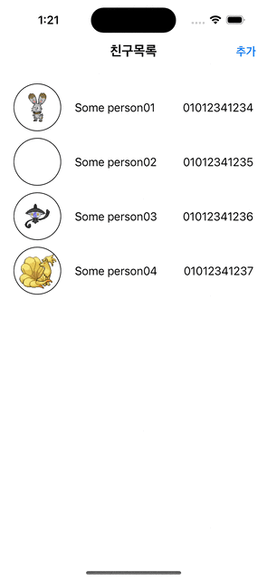

# NBC_PhoneBook

## Stacks
### Environment
* XCode
* Git

### Development
* Swift 5.0

### Library
* SnapKit
* Alamofire
* Kingfisher

## 구현내용
* SnapKit을 활용한 어플리케이션 전반적인 AutoLayout 설정
* URLSession기반 네트워크 통신
* Alamofire기반 네트워크 통신(리펙토링)
* Kingfisher기반 이미지 다운로드
* CustomView 객체 구현을 통해 재사용성 확보
* Delegate Pattern을 통해 View와 Controller간 결합도 낮춤
* Closure를 통해 Controller와 Model 바인딩
* UserDefaults 기반 JSON 데이터 CRUD 구현

## 시연영상

